# CUDA : Contradistinguisher for Unsupervised Domain Adaptation
Paper accepted in **<a href="http://icdm2019.bigke.org/">ICDM 2019：19th IEEE International Conference on Data Mining</a>**, Beijing, China, 8-11 November 2019.

The original code base for the experiments and results for Image datasets.

Bibtex :

```
@inproceedings{DBLP:conf/icdm/BalgiD19,
  author    = {Sourabh Balgi and
               Ambedkar Dukkipati},
  editor    = {Jianyong Wang and
               Kyuseok Shim and
               Xindong Wu},
  title     = {{CUDA:} Contradistinguisher for Unsupervised Domain Adaptation},
  booktitle = {2019 {IEEE} International Conference on Data Mining, {ICDM} 2019,
               Beijing, China, November 8-11, 2019},
  pages     = {21--30},
  publisher = {{IEEE}},
  year      = {2019},
  url       = {https://doi.org/10.1109/ICDM.2019.00012},
  doi       = {10.1109/ICDM.2019.00012},
  timestamp = {Mon, 03 Feb 2020 19:47:40 +0100},
  biburl    = {https://dblp.org/rec/conf/icdm/BalgiD19.bib},
  bibsource = {dblp computer science bibliography, https://dblp.org}
}
```

Paper URL :

<a href="https://arxiv.org/abs/1909.03442">CUDA: Contradistinguisher for Unsupervised Domain Adaptation</a>


## Installation

You will need:

- Python 3.6 (Anaconda Python recommended)
- torch (PyTorch) 
- torchvision
- nltk
- pandas
- scipy
- tqdm
- scikit-image 
- scikit-learn  
- tensorboardX
- tensorflow==1.13.1 (for tensorboard visualizations)

## Installation Instructions

On Linux:

```> conda install pytorch torchvision cudatoolkit=10.0 -c pytorch```

install relevant cuda if GPUs are available. 
Use of GPUs is very much recommended and inevitable because of the size of the model and datasets.

### The rest of the dependencies

Use requirements.txt in the respective sub-folders with pip as below:

```> pip install -r requirements.txt```

# Toydataset Domain Adaptation Experiments ([toydataset_README.md](toydataset/README.md))
Full details on toydataset domain adaptation including codes in [`toydataset`](toydataset) subdirectory.

```> cd toydataset```

## Synthetic Toydataset using blobs
We create two blobs in 2D to represent 2 classes. We create 2 sets of such blobs one for each domain D0 and D1.

### Sample plots for comparison of Source and Target domains
Following images are illustrations of images from Source (odd columns) and Target (even columns) domains with one example per class.

The plots also illustrate the difference between the CUDA vs all the other domain alignment approaches used for domain adaptation.

### Comparison of standard domain alignment approaches vs CUDA
- Example toydataset 1 with seed 22 : 
    
    | Method | D0 -> D1 | D1 -> D0 |
    | :---: | :---: | :---: |
    | Domain Alignment Approaches |  |  | 
    | CUDA |  |  | 

- Example toydataset 2 with seed 3234 :

    | Method | D0 -> D1 | D1 -> D0 |
    | :---: | :---: | :---: |
    | Domain Alignment Approaches |  |  | 
    | CUDA |  |  | 

- As seen above, the domain alignment approaches align the target domain over source domain to completely morph source and target domains.
After morphing, a classifier is learnt on the labeled source domain. Due to the change of source domain on swapping domains, the classifier learnt mainly depends on the source domain.

- On the contrast, Since CUDA jointly learns on both the domains in source supervised + target unsupervised manner, the same classifier adapts to learn the best possible decision boundary.
Hence the decision boundaries are almost the same even when the source and target domains are swapped.

### More illustrations of the Contradistinguisher learnt using CUDA
| |  | 
| :---: | :---: |
| |  | 
| |  | 
|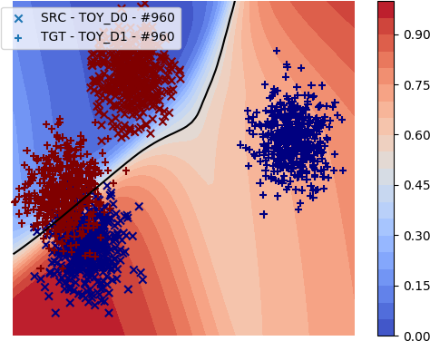 | 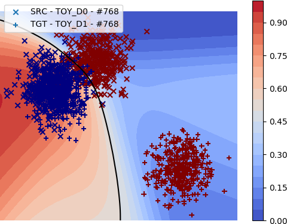 | 
| | 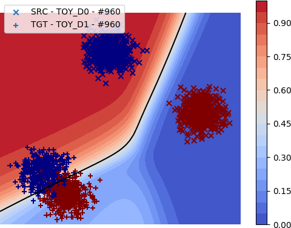 | 
|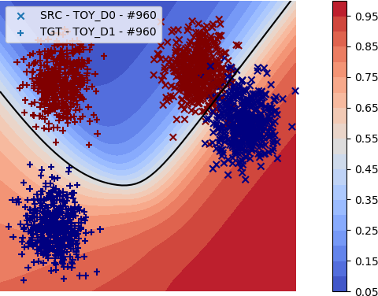 | 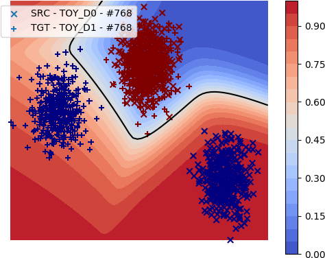 | 
|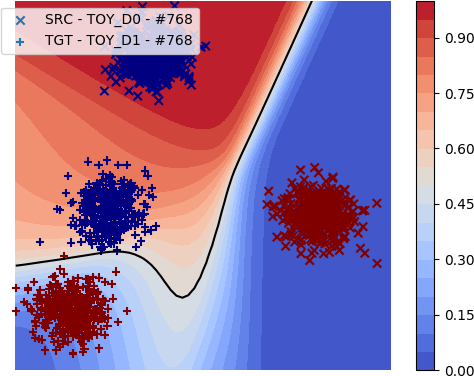 |  | 
|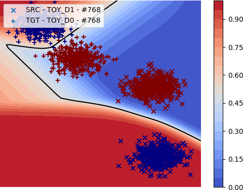 | 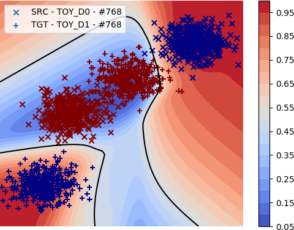 | 
|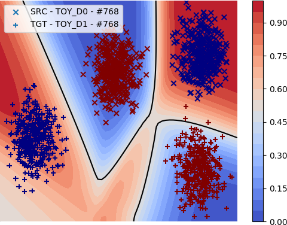 | 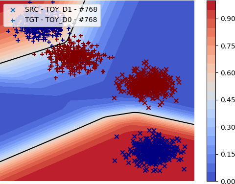 | 
|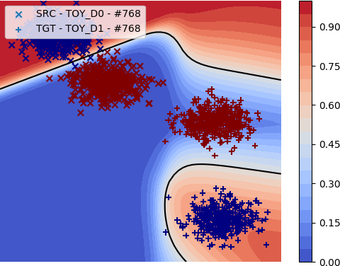 |  | 
|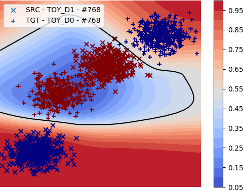 | 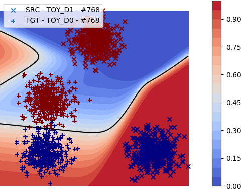 | 
| | 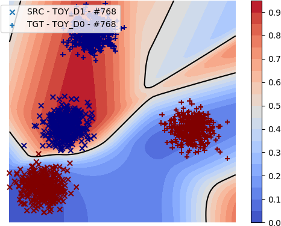 | 

## Illustration of the training process of contradistinguisher using CUDA
[`toydataset/git_images/plots/videos`](toydataset/git_images/plots/videos) contains videos of the training of Contradistinguisher using CUDA as the epoch progresses.
We can observe the decision boundary being updated to satisfy both the domains as they are jointly trained without domain alignment.
- `ss` : source supervised only setting with domain alignment
- `ss_tu` : source supervised + target unsupervised only setting with CUDA
- `ss_tu_ta` : source supervised + target unsupervised + target adversarial setting with CUDA

| |  |  | 
| :---: | :---: | :---: |
| seed 22 : ss | seed 22 : ss_tu | seed 22 : ss_tu_ta |
| |  |  | 
| seed 22 : ss | seed 22 : ss_tu | seed 22 : ss_tu_ta |
| |  |  | 
| seed 3234 : ss | seed 3234 : ss_tu | seed 3234 : ss_tu_ta |
| |  |  | 
| seed 3234 : ss | seed 3234 : ss_tu | seed 3234 : ss_tu_ta |

More illustrations of CUDA with different domain shifts and orientations

| |  |  | 
| :---: | :---: | :---: |
| |  |  | 
| |  |  | 

# Visual Domain Adaptation Experiments ([visual_README.md](visual/README.md))
Full details on visual domain adaptation including codes in [`visual`](visual) subdirectory.

## Visual Domain Adaptation
The experiments in visual domain includes Digits, Objects and Traffic signs.
- **Digits** : USPS, MNIST, SVHN, SYNNUMBERS with 10 digits for classification
    - **USPS** : <a href="https://web.stanford.edu/~hastie/ElemStatLearn//datasets/zip.train.gz">Train</a>, <a href="https://web.stanford.edu/~hastie/ElemStatLearn//datasets/zip.test.gz">Test</a>
    - **MNIST** : <a href="http://yann.lecun.com/exdb/mnist/">MNIST</a>
    - **SVHN** : <a href="http://ufldl.stanford.edu/housenumbers/">SVHN</a>
    - **SYNNUMBERS** : <a href="https://drive.google.com/file/d/0B9Z4d7lAwbnTSVR1dEFSRUFxOUU/view">SYNNUMBERS</a>
- **Objects** : CIFAR, STL with 9 overlapping classes for classification
    - **CIFAR** : <a href="https://www.cs.toronto.edu/~kriz/cifar.html">CIFAR</a>
    - **STL** : <a href="https://cs.stanford.edu/~acoates/stl10/">STL</a>
- **Traffic Signs** : SYNSIGNS, GTSRB with 43 classes for classification
    - **SYNSIGNS** : <a href="http://graphics.cs.msu.ru/en/node/1337">SYNSIGNS</a>
    - **GTSRB** : <a href="http://benchmark.ini.rub.de/?section=gtsrb&subsection=dataset#Downloads">GTSRB</a>

The experiments in visual domain includes real world objects from Office dataset.
- **Office Objects** : Objects from Office-31 dataset with 3 real world domain AMAZON, DSLR, WEBCAM with 31 classes for classification
    - **AMAZON, DSLR, WEBCAM** : <a href="https://people.eecs.berkeley.edu/~jhoffman/domainadapt/">Office-31</a>

### Visual Domain Adaptation Dataset Statistics

| |
|:---:|
| Visual dataset statistics used for visual domain adaptation|

### Results
| |
|:---:|
| Target domain test accuracy reported using CUDA over several SOTA domain alignment methods|

# Language Domain Adaptation Experiments ([language_README.md](language/README.md))
Full details on language domain adaptation including codes in [`language`](language) subdirectory.

## Language Domain Adaptation
We consider Amazon Customer Reviews Dataset with 4 domains Books, DVDs, Electronics and Kitchen Appliances located in [data](data) folder.
Each domain has 2 classes positive and negative reviews as labels of binary classification.

### Language Domain Adaptation Dataset Statistics

| |
|:---:|
| Language dataset statistics used for language domain adaptation|

### Results
| |
|:---:|
| Target domain test accuracy reported using CUDA over several SOTA domain alignment methods|

# Acknowledgements
Special thanks to <a href="http://sml.csa.iisc.ac.in/index.html">Statistics and Machine Learning Group</a>, <a href="https://www.csa.iisc.ac.in/">Department of Computer Science and Automation</a>, <a href="https://www.iisc.ac.in/">Indian Institute of Science</a>, Bengaluru, India for proving the necessary computational resources for the experiments.

# Author Details

Sourabh Balgi

M. Tech., Artificial Intelligence

Indian Institute of Science, Bangalore

## Contact info:

\<firstname>\<lastname>[at]gmail[dot]com, \<firstname>\<lastname>[at]iisc[dot]ac[dot]in
