# CUDA-LDA : Contradistinguisher for Unsupervised Domain Adaptation - Language Domain Adaptation
Paper accepted in **<a href="http://icdm2019.bigke.org/">ICDM 2019：19th IEEE International Conference on Data Mining</a>**, Beijing, China, 8-11 November 2019.

The original code base for the experiments and results for language datasets.

## Language Domain Adaptation
We consider Amazon Customer Reviews Dataset with 4 domains Books, DVDs, Electronics and Kitchen Appliances located in [data](data) folder.
Each domain has 2 classes positive and negative reviews as labels of binary classification.

## Installation

You will need:

- Python 3.6 (Anaconda Python recommended)
- PyTorch 
- torchvision
- nltk
- pandas
- scipy
- tqdm
- scikit-image 
- scikit-learn  
- tensorboardX
- tensorflow==1.13.1 (for tensorboard visualizations)

### PyTorch

On Linux:

```> conda install pytorch torchvision cudatoolkit=10.0 -c pytorch```

install relevant cuda if GPUs are available. 
Use of GPUs is very much recommended and inevitable because of the size of the model and datasets.

### The rest of the dependencies

Use pip as below:

```> pip install -r requirements.txt```

## Datasets

We consider Amazon Customer Reviews Dataset with 4 domains Books (B) , DVDs (D), Electronics (E) and Kitchen Appliances (K) located in [data](data) folder.
Each domain has 2 classes positive and negative reviews as labels of binary classification.
The processed data of Amazon CUstomer Reviews dataset is obtained from <a href="https://github.com/ccsasuke/man">MAN</a> github repo.

#### Language Domain Adaptation Dataset Statistics

|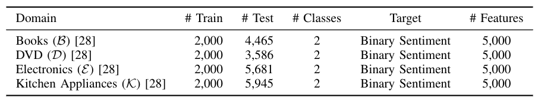 |
|:---:|
| Language dataset statistics used for language domain adaptation|


## Results
|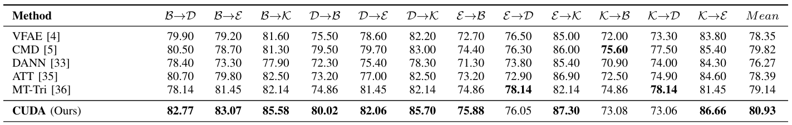 |
|:---:|
| Target domain test accuracy reported using CUDA over several SOTA domain alignment methods|

### t-SNE plots which indicate the domain adaptation using CUDA
|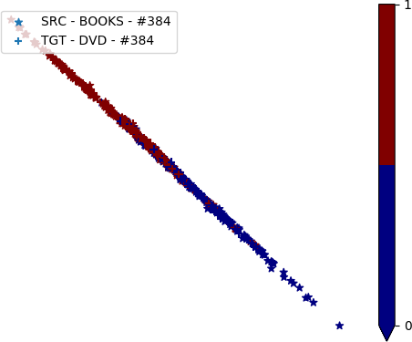 |  | 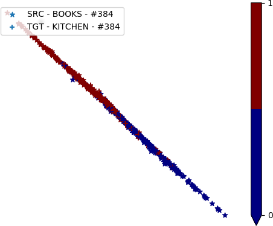 | 
| :---: | :---: | :---: |
| B -> D | B -> E | B -> K |
| | 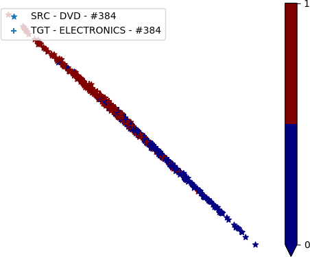 | 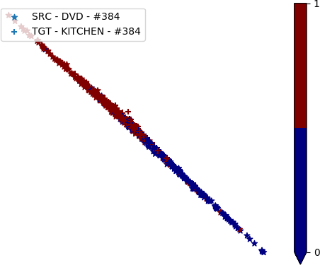 | 
| D -> B | D -> E | D -> K |
| | 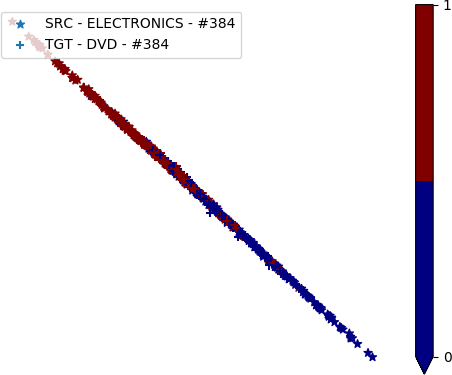 | 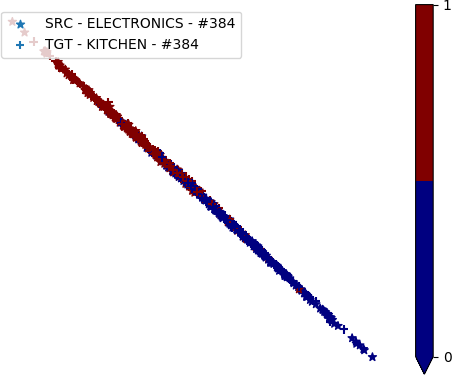 | 
| E -> B | E -> D | E -> K |
|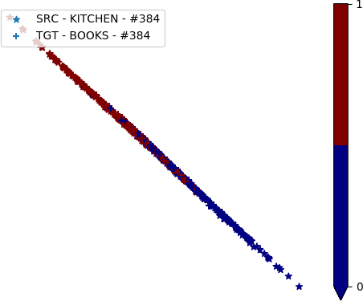 | 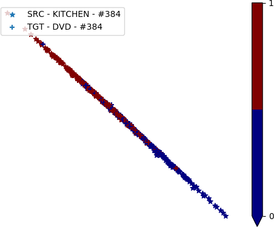 | 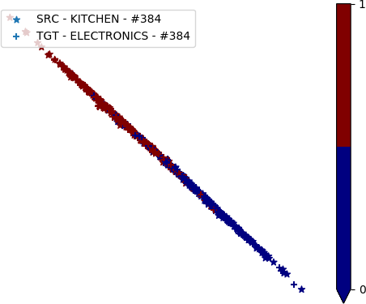 | 
| K -> B | K -> D | K -> E |
   
- The t-SNE plots indicates inclined line-like clustering in both Source (x) and Target (+) domain with each class at either ends.

## Code and instructions coming soon!!!
