# CUDA-TDA : Contradistinguisher for Unsupervised Domain Adaptation - Toydataset Domain Adaptation
Paper accepted in **ICDM 2019：19th IEEE International Conference on Data Mining**, Beijing, China, 8-11 November 2019.

The original code base for the experiments and results for Toy datasets.

## Toy Dataset Domain Adaptation
Demonstration of the Contradistinguisher characteristics on synthetically created toy datasets.
The source and target domains are created in such a way that they have different offset and class orientations to indicate different **domain shifts**.

## Installation

You will need:

- Python 3.6 (Anaconda Python recommended)
- PyTorch 
- torchvision
- nltk
- pandas
- scipy
- tqdm
- scikit-image 
- scikit-learn  
- tensorboardX
- tensorflow==1.13.1 (for tensorboard visualizations)

### PyTorch

On Linux:

```> conda install pytorch torchvision cudatoolkit=10.0 -c pytorch```

install relevant cuda if GPUs are available. 
Use of GPUs is very much recommended and inevitable because of the size of the model and datasets.

### The rest of the dependencies

Use pip as below:

```> pip install -r requirements.txt```

## Synthetic Toy Dataset using blobs
We create two blobs in 2D to represent 2 classes. We create 2 sets of such blobs one for each domain D0 and D1.

### Sample plots for comparison of Source and Target domains
Following images are illustrations of images from Source (odd columns) and Target (even columns) domains with one example per class.

The plots also illustrate the differnece between the CUDA vs all the other domain alignemnt approaches used for domain adaptation.

### Comparison of standard domain alignment approaches vs CUDA
- Example toydataset 1 with seed 22 : 

    | Method | D0 -> D1 | D1 -> D0 |
    | :---: | :---: | :---: |
    | Domain Alignment Approaches | 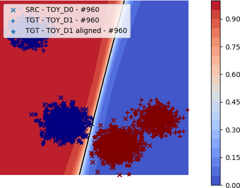 | 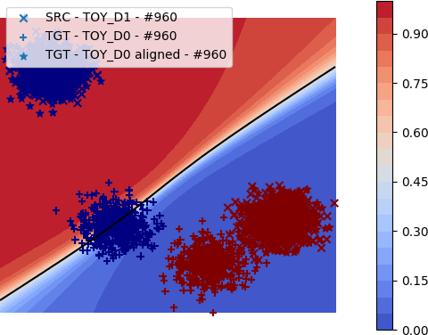 | 
    | CUDA | 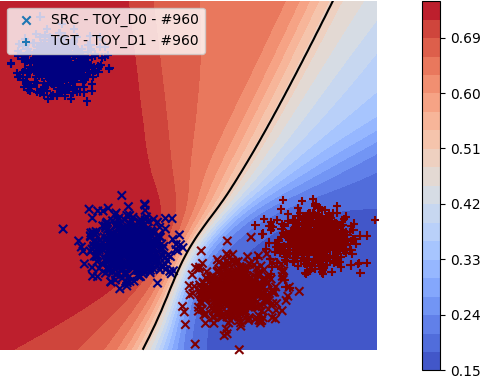 | 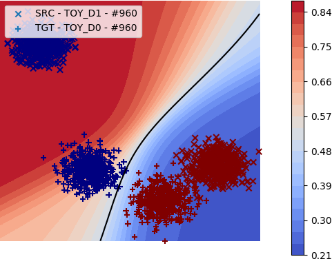 | 

- Example toydataset 2 with seed 3234 :

    | Method | D0 -> D1 | D1 -> D0 |
    | :---: | :---: | :---: |
    | Domain Alignment Approaches | 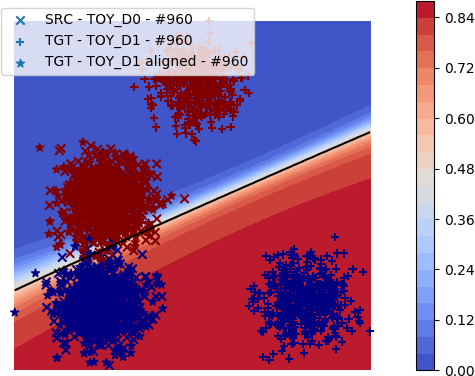 | 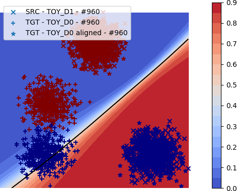 | 
    | CUDA | 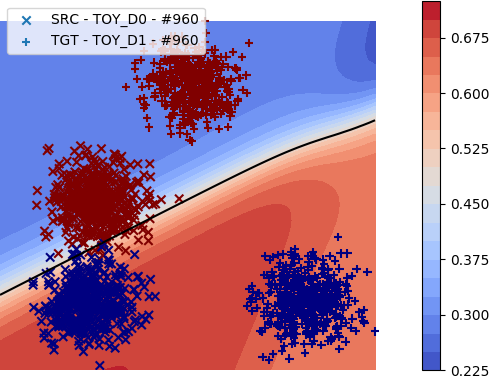 | 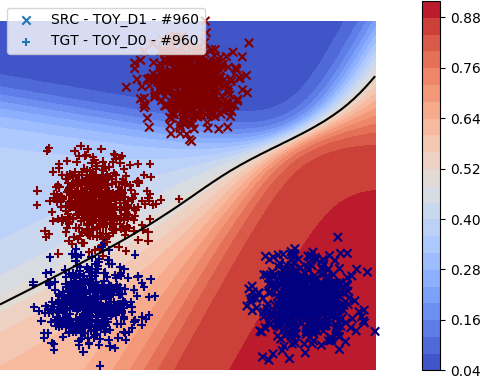 | 

- As seen above, the domain alignment approaches align the target domain over source domain to completely morph source and target domains.
After morphing, a classifier is learnt on the labeled source domain. Due to the change of source domain on swapping domains, the classifier learnt mainly depends on the source domain.

- On the contrast, Since CUDA jointly learns on both the domains in source supervised + target unsupervised manner, the same classifier adapts to learn the best possible decision boundary.
Hence the decision boundaries are almost the same even when the source and target domains are swapped.

### More illustrations of the Contradistinguisher learnt using CUDA
|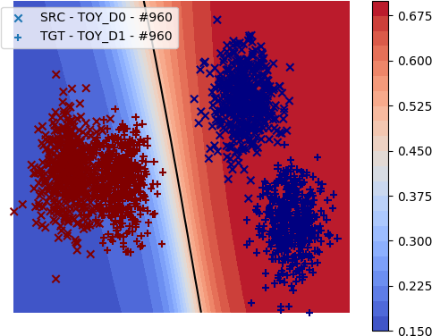 | 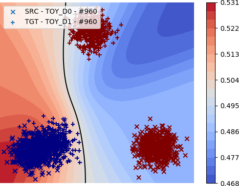 | 
| :---: | :---: |
|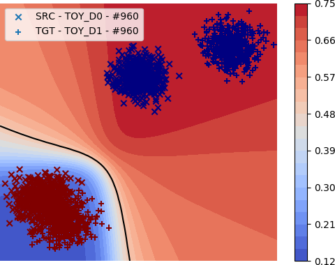 | 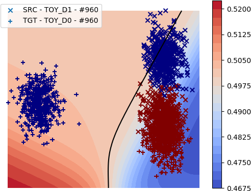 | 
|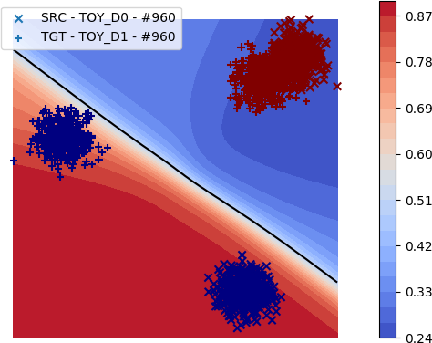 |  | 
|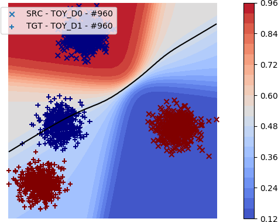 | 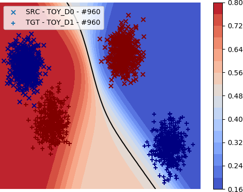 | 

## Illustration of the training process of contradistinguisher using CUDA
[`git_images/plots/videos`](git_images/plots/videos) contains videos of the training of Contradistinguisher using CUDA as the epoch progresses.
We can observe the decision boundary being updated to satisfy both the domains as they are jointly trained without domain alignment.
- `ss` : source supervised only setting with domain alignment
- `ss_tu` : source supervised + target unsupervised only setting with CUDA
- `ss_tu_ta` : source supervised + target unsupervised + target adversarial setting with CUDA

| |  |  | 
| :---: | :---: | :---: |
| seed 22 : ss | seed 22 : ss_tu | seed 22 : ss_tu_ta |
| |  |  | 
| seed 22 : ss | seed 22 : ss_tu | seed 22 : ss_tu_ta |
| |  |  | 
| seed 3234 : ss | seed 3234 : ss_tu | seed 3234 : ss_tu_ta |
| |  |  | 
| seed 3234 : ss | seed 3234 : ss_tu | seed 3234 : ss_tu_ta |

More illustrations of CUDA with different domain shifts and orientations

| |  |  | 
| :---: | :---: | :---: |
| |  |  | 
| |  |  | 

## Instructions to run the toydataset experiments

The `cuda.sh` file consists of all the experiments to run.
The lines are commented as the running all experiemnts at once is not possible in our current hardware.

To run, uncomment the relevant line for the experiment.

### Code details

- `cuda_toydataset_ss.py` : Code for source supervised only setting
- `cuda_toydataset_ss_tu.py` : Code for source supervised + target unsupervised only setting
- `cuda_toydataset_ss_tu_ta.py` : Code for source supervised + target unsupervised + target adversarial setting
