# CUDA-VDA : Contradistinguisher for Unsupervised Domain Adaptation - Visual Domain Adaptation
Paper accepted in **ICDM 2019：19th IEEE International Conference on Data Mining**, Beijing, China, 8-11 November 2019.

The original code base for the experiments and results for visual datasets.

### Visual Domain Adaptation
The experiments in visual domain includes Digits, Objects and Traffic signs.
- **Digits** : USPS, MNIST, SVHN, SYNNUMBERS with 10 digits for classification
    - **USPS** : <a href="https://web.stanford.edu/~hastie/ElemStatLearn//datasets/zip.train.gz">Train</a>, <a href="https://web.stanford.edu/~hastie/ElemStatLearn//datasets/zip.test.gz">Test</a>
    - **MNIST** : <a href="http://yann.lecun.com/exdb/mnist/">MNIST</a>
    - **SVHN** : <a href="http://ufldl.stanford.edu/housenumbers/">SVHN</a>
    - **SYNNUMBERS** : <a href="https://drive.google.com/file/d/0B9Z4d7lAwbnTSVR1dEFSRUFxOUU/view">SYNNUMBERS</a>
- **Objects** : CIFAR, STL with 9 overlapping classes for classification
    - **CIFAR** : <a href="https://www.cs.toronto.edu/~kriz/cifar.html">CIFAR</a>
    - **STL** : <a href="https://cs.stanford.edu/~acoates/stl10/">STL</a>
- **Traffic Signs** : SYNSIGNS, GTSRB with 43 classes for classification
    - **SYNSIGNS** : <a href="http://graphics.cs.msu.ru/en/node/1337">SYNSIGNS</a>
    - **GTSRB** : <a href="http://benchmark.ini.rub.de/?section=gtsrb&subsection=dataset#Downloads">GTSRB</a>
    
The experiments in visual domain includes real world objects from Office dataset.
- **Office Objects** : Objects from Office-31 dataset with 3 real world domain AMAZON, DSLR, WEBCAM with 31 classes for classification
    - **AMAZON, DSLR, WEBCAM** : <a href="https://people.eecs.berkeley.edu/~jhoffman/domainadapt/">Office-31</a>

#### Visual Domain Adaptation Dataset Statistics

|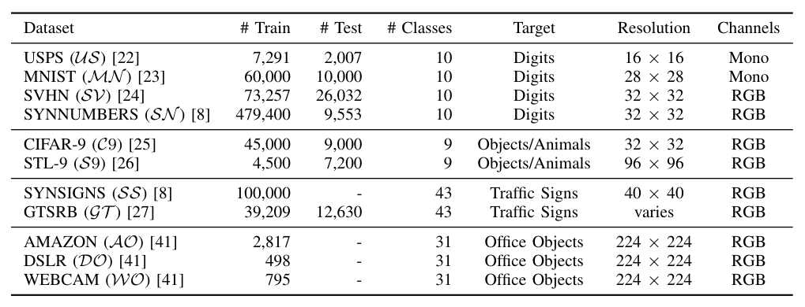 |
|:---:|
| Image dataset statistics used for visual domain adaptation|

## Installation

You will need:

- Python 3.6 (Anaconda Python recommended)
- PyTorch 
- torchvision
- nltk
- pandas
- scipy
- tqdm
- scikit-image 
- scikit-learn  
- tensorboardX
- tensorflow==1.13.1 (for tensorboard visualizations)

### PyTorch

On Linux:

```> conda install pytorch torchvision cudatoolkit=10.0 -c pytorch```

install relevant cuda if GPUs are available. 
Use of GPUs is very much recommended and inevitable because of the size of the model and datasets.

### The rest of the dependencies

Use pip as below:

```> pip install -r requirements.txt```

## Datasets

Instructions for setting up data required for the experiments are in `README.md` in [data](data) folder.

### Sample plots for comparison of digits datasets
Following images are illustrations from digit domains with one example from all 10 class.

|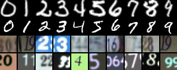|
| :---: |
- Row 1 : Images from USPS
- Row 2 : Images from MNIST
- Row 3 : Images from SVHN
- Row 4 : Images from SYNNUMBERS

### Sample plots for comparison of objects datasets
Following images are illustrations from object domains with one example from all 9 overlapping class.

| |
| :---: |
- Row 1 : Images from CIFAR
- Row 2 : Images from STL

### Sample plots for comparison of traffic sign datasets
Following images are illustrations from traffic sign domains with one example from all 43 class.

|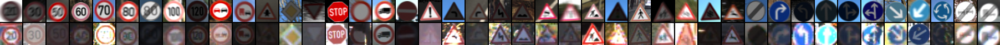 |
| :---: |
- Row 1 : Images from SYNSIGNS
- Row 2 : Images from GTSRB

### Sample plots for comparison of Office-31 datasets
Following images are illustrations from traffic sign domains with one example from all 43 class.

| |
| :---: |
- Row 1 : Images from AMAZON
- Row 2 : Images from DSLR
- Row 3 : Images from WEBCAM

## Results
|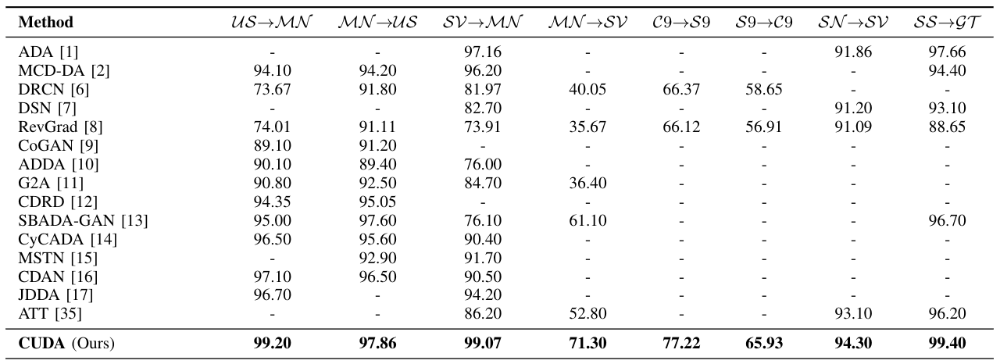 |
|:---:|
| Target domain test accuracy reported using CUDA over several SOTA domain alignment methods|

### t-SNE plots which indicate the domain adaptation using CUDA
- **USPS <-> MNIST** :
    - **usps_mnist using CUDA** : The clear clustering of 10 classes can be observed. 
    
    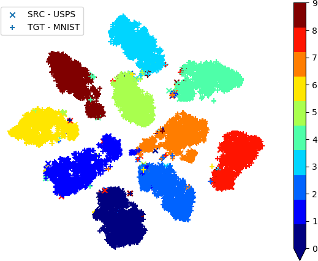
    
    - **mnist_usps using CUDA** : The clear clustering of 10 classes can be observed. 
    
    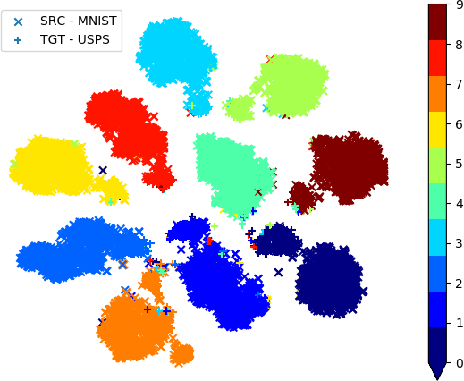
    
- **SVHN -> MNIST** :
    - **svhn_mnist using CUDA** : The clear clustering of 10 classes can be observed. 
    
    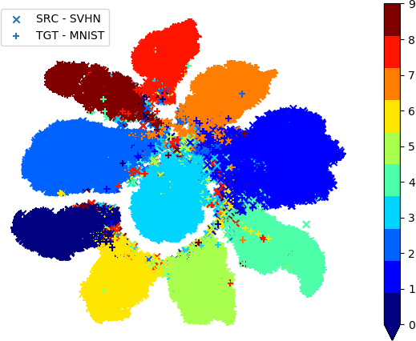
    
- **SYNDIGITS -> SVHN** :
    - **syndigits_svhn using CUDA** : The clear clustering of 10 classes can be observed.
    
    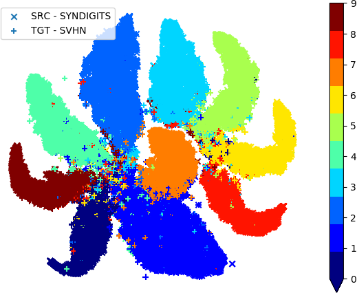
    
- **CIFAR9 <-> STL9** :
    - **cifar_stl using CUDA** : The clear clustering of 9 classes can be observed.
    
    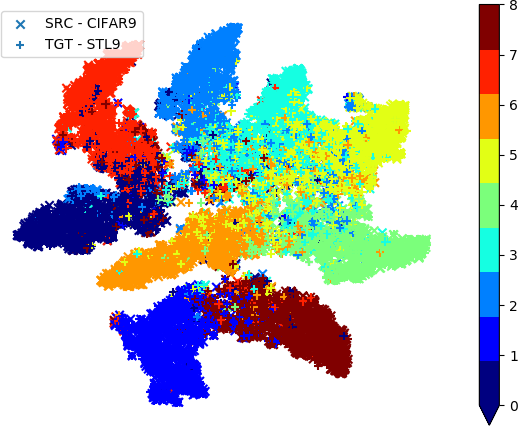
    
    - **stl_cifar using CUDA** : The clear clustering of 9 classes can be observed.
    
    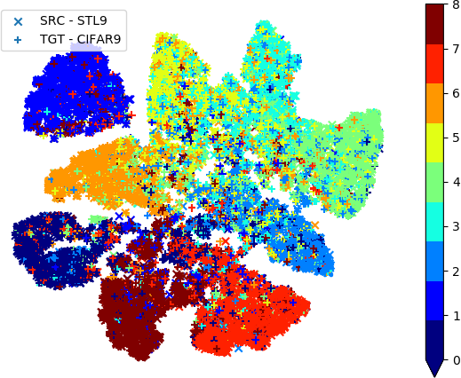
    
- **SYNSIGNS -> GTSRB** :
    - **synsigns_gtsrb using CUDA** : The clear clustering of 43 classes can be observed.
    
    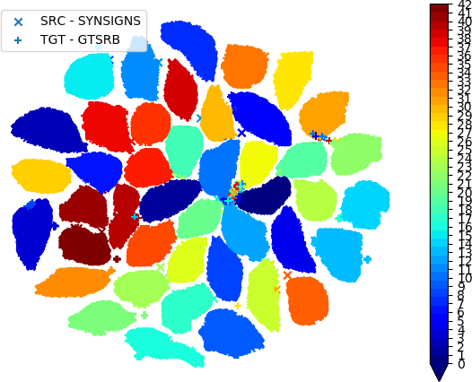
    
- **MNIST -> SVHN** : t-SNE plots as the training progresses using CUDA.
    - **mnist_svhn with randomly initialized network** : The clustering of (x) and (+) as 2 separate blobs indicates the domain shift present between the Source and Target domains.
    
    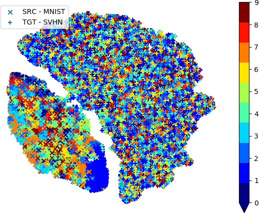
    
    - **mnist_svhn after one epoch using CUDA** : The clear clustering of 10 classes in Source (x) domain can be observed. The domain shift can also be observed as Source (x) domain is into top half and Target (+) domain is in the bottom half.
    
    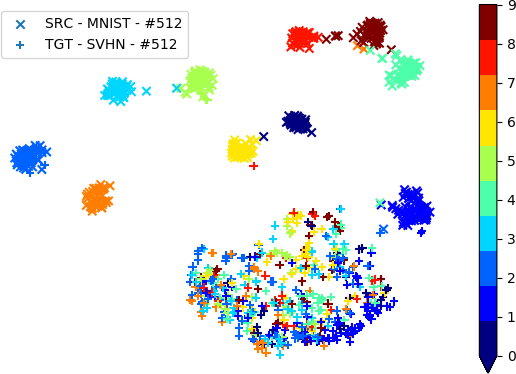
    
    - **mnist_svhn after 5 epochs using CUDA** :  The clear clustering of 10 classes in Source (x) domain can be observed. The domain shift can also be observed as Source (x) domain is into top half and Target (+) domain is in the bottom half. But it can be seen that the domain shift is decreasing due to mearging of domains compared with the plots from first epoch.
    
    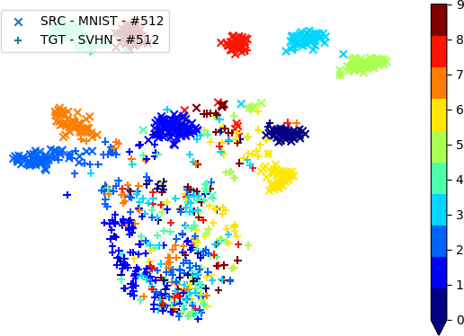
    
    - **mnist_svhn after full training using CUDA** :  The clear clustering of 10 classes in Source (x) domain can be observed. After 20 epochs, The clear decrease in domain shift can also be observed as Source (x) and Target (+) domains are morphing into each other.
    
    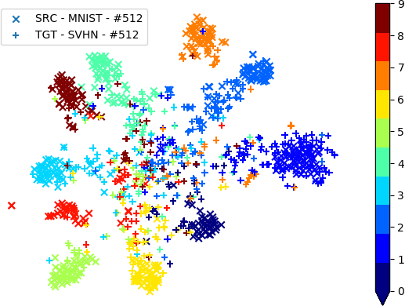
    

- The t-SNE plots clearly indicates the distantly separated classes in both Source (x) and Target (+) domain.
- Also the morphing of Source (x) and Target (+) domain datapoints in the t-SNE plots indicate the success of CUDA in domain adaptation  

## Code and instructions coming soon!!!